# DEEP MOUSE

In this project, we follow the thought processes behind the development of a simple neural network. It is an A-to-Z description of a neural network construction, starting from the acquisition of the dataset up to the evaluation of the model, including errors and steps-back.

The goal of this toy algorithm is to identify if the laptop track-pad is used either with the right or the left hand just by looking at the position of the mouse cursor in time. The scheme of the development process can be sketched as follow:

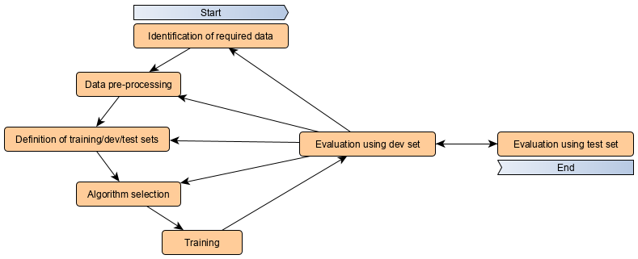

It is an iterative process that periodically ends with the evaluation of the model using the **dev** (development) dataset. The iteration continues until the accuracy obtained on the dev set reaches our goal. Only at this point, the model is tested on the **test** dataset.

## Iterations index
- [First model implementation 01](#identification-of-required-data---01)
- [Data pre-processing 02](#data-pre-processing---02)
- [Algorithm optimizer 03](#algorithm-selection---03)
- [Neural Network structure 04](#algorithm-selection---04)
- [Testing SVM 05](#algorithm-selection---05)
- [LSTM size and learning rate with Bayesopt 06](#lstm-size-and-learning-rate-with-Bayesopt---06)
- [Introducing dropout 07](#introducing-dropout---07)
- [Checking training set size 08](#checking-training-set-size---08)
- [New, bigger, dataset - 09](#New-bigger-dataset---09)
- [GRU instead of LSTM - 10](#gru-instead-of-lstm---10)
- [GRU and overfitting - 11](#gru-and-overfitting---11)
- [GRU with mouse movement - 12](#gru-and-mouse-movement---12)


### Identification of required data - 01[🡅](#iterations-index)
To train a model to recognize which hand is moving the mouse, we opted for a supervised learning approach and we, therefore, need labeled data for the training. The structure of the dataset is a *.csv* file with two columns indicating the *x* and *y* absolute coordinate of the mouse cursor on the screen. The position is recorded every \~10ms. To create the training set, we recorded the mouse position for about 10 minutes, first by using the right hand (while reading a technical blog post), then doing the same task by using the left hand. The total amount of samples is 120k (60k right, 60k left).
The data are acquired using the win32gui library and stored in a *.txt* file via a python script:
```python
import win32gui, time
with open('./data/my_data.txt', 'a') as f:
    for _ in range(number_of_samples):
        x, y = win32gui.GetCursorPos()
        f.write('{},{}\n'.format(x, y))
        time.sleep(0.01)
```
Right hand data are saved on *./data/right.txt* file, left hand data on *./data/left.txt* file.
As shown in the plot below the real-time delay between subsequent acquisitions is not completely constant, moreover, spikes are present.

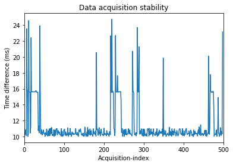

A possible improvement might be achieved by a pure c acquisition program, which includes a time delay to check every loop. For the moment, since we do not know the impact of a more stable acquisition for the model accuracy, we postpone the problem for later iterations.

### Data pre-processing - 01[🡅](#iterations-index)
[Back to index](#iterations-index)
The full 20 minutes dataset is split into batches of 200 points each, corresponding to 2 seconds of mouse position acquisitions. Right, and left-hand data are merged in a single dataset. For the moment we use raw data from the input device, being the absolute coordinate along the horizontal and vertical direction of the screen.

---------------
Loading the mouse data from the *.txt* file using **pandas**:
```python
import pandas as pandas
right = pd.read_csv("../data/right.txt", header=None).values.tolist()
left = pd.read_csv("../data/left.txt", header=None).values.tolist()
```
Splitting the data in 600 batches containing 200 data-points each:
```python
batch_size = 200
batch_right = [right[i:i + batch_size] for i in range(0, len(right), batch_size)]
batch_left = [left[i:i + batch_size] for i in range(0, len(left), batch_size)]
```
Merging left and right datasets and convert them into **numpy** arrays. Create the target array `y` using as convention *0* for batches corresponding tho right hand and *1* for left hand. The axis of the `X` array correspond to: (batch index, mouse position in time, mouse coordinate index).

```python
import numpy as np
X = np.array(batch_right + batch_left)
y = np.array([0]*len(batch_right) + [1]*len(batch_left))

print(f'X shape: {X.shape}\ny shape: {y.shape}')
```
```text
X shape: (600, 200, 2)
y shape: (600,)
```

For the moment the decision of creating batches of 200 data-points is arbitrary and we still do not know if we might need for longer batches to achieve good accuracy. A batch of 200 points, using a 100Hz acquisition rate, means that we need 2 seconds of acquisition before the model can predict a result. In the plot below we show the data contained in a single data batch.

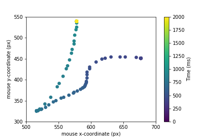


### Definition of the training set - 01[🡅](#iterations-index)
[Back to index](#iterations-index)
**Training**, **dev** and **test** sets are split in a 70%-15%-15% proportion. The training set is used for training the network, the dev set as a benchmark to optimize the ML algorithm and finally the test set to measure the accuracy of the model. It is important to keep dev and test set separated to avoid the over-fitting of the hyper-parameters of the model on the test set. 

------------
The splitting between train/dev/test is achieved using the **sklearn** library.
```python
from sklearn.model_selection import train_test_split

X_train, X_test, y_train, y_test = train_test_split(X, y, test_size=0.30, random_state=1)
X_dev, X_test, y_dev, y_test = train_test_split(X_est, y_est, test_size=0.5, random_state=1)
```

### Algorithm selection - 01[🡅](#iterations-index)
As a starting point algorithm we opted for a **RNN** (recurrent neural network). In particular, inspired from this [blog post](https://www.analyticsvidhya.com/blog/2019/01/introduction-time-series-classification/#), we used a **LSTM** (Long short-term memory) architecture.

-------------------
We implemented the neural network in **keras** using **TensorFlow backend**:
```python
import tensorflow as tf
from keras.models import Sequential
from keras.layers import Dense
from keras.layers import LSTM

model = Sequential()
model.add(LSTM(256, input_shape=(batch_size, 2)))
model.add(Dense(1, activation='sigmoid'))

model.summary()
```
```text
_________________________________________________________________
Layer (type)                 Output Shape              Param #   
=================================================================
lstm_1 (LSTM)                (None, 256)               265216    
_________________________________________________________________
dense_1 (Dense)              (None, 1)                 257       
=================================================================
Total params: 265,473
Trainable params: 265,473
Non-trainable params: 0
_________________________________________________________________
```

The training is performed using **stochastic gradient descent**, in particular using the **Adam** algorithm (short for Adaptive Moment Estimation). We used the *accuracy* metric and we trained the data for 200 epochs. We save the best model as *best_model.pkl*. It takes about 8 minutes to train the model using a regular laptop.
```python
from keras.optimizers import Adam
from keras.callbacks import ModelCheckpoint

adam = Adam(lr=0.001)
chk = ModelCheckpoint('best_model.pkl', monitor='acc', save_best_only=True, mode='max', verbose=0)
model.compile(loss='binary_crossentropy', optimizer=adam, metrics=['accuracy'])
history = model.fit(X_train, y_train, epochs=200, batch_size=64, callbacks=[chk], validation_data=(X_dev, y_dev))
```
The learning process during the gradient descent can be inspected by monitoring the accuracy of the model and the loss function, computed both on the training and the dev set.

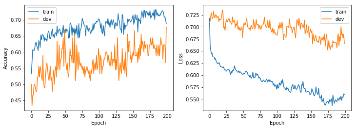

The **accuracy** describes the ratio between the correct and the total guesses:
```text 
accuracy = number_of_correct_prediction / total_number_of_prediction_made
```
 The loss-function correspond to the **binary cross-entropy**, which is given by:
```text
loss = -(y log(p) + (1-y) log(1-p))
```
where `y` is the target correct binary label (0 for the right hand, 1 for left hand) and `p` is the predicted probability for a given data batch to be a left-hand batch. When the cross-entropy is *1* the model is useless and it is equivalent to a random guess. When it is *0* the model perfectly predicts the target given a single data batch.


### Evaluation of the model - 01[🡅](#iterations-index)
A simple validation of the model can be achieved using the **confusion matrix**, which reports the measure of the correct and non-correct labels computed by the model on the dev set.

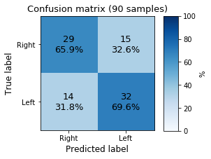

The model produces a very poor result but pieces of information seem to be present in the data. We can also test the model "live", loading it and using the script:
```python
from keras.models import load_model
import win32gui, time
model = load_model(f'../models/model_name.pkl')

def get_batch(batch_size=200):
    X_pred = np.ones([1, batch_size, 2])
    for index in range(batch_size):
        x, y = win32gui.GetCursorPos()
        X_pred[0,index,:] = np.array([x, y])
        time.sleep(0.01)
    return X_pred

time_in_sec = 30
left_guesses = 0
for index in range(1, max(2, int(time_in_sec/2))):
    X_pred = get_batch()
    pred = model.predict_classes(X_pred)[0][0]
    left_guesses += pred
    print(f'\rRun_{index}: Current prediction = {"Left " if pred else "Right"}   '+
        f'Left probability = {left_guesses/index * 100:.1f}%   '+
        f'Right probability = {(1 - left_guesses/index) * 100:.1f}%', end='')
 ```

### Data pre-processing - 02[🡅](#iterations-index)
An almost useful and safe pre-processing technique on data is their **normalization**. For the moment we used absolute screen coordinate but a very easy improvement is to normalize them by using the screen height and width. Another option is to convert the absolute position of the mouse to the movement performed in 10ms. This might be useful because it simplifies the problem introducing a translational invariance along the coordinate, which looks to be a good symmetry to exploit. We start from this second option:
```python 
X_diff = X[:,:-1,:].copy()
X_diff[:,:,0] = np.diff(X[:,:,0])
X_diff[:,:,1] = np.diff(X[:,:,1])
```
At this point it is worthed to look at the relative movement amplitude distribution:

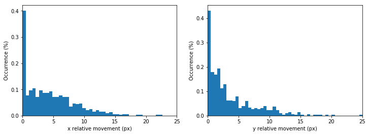

As we can see, the mouse cursor movement in 10ms ranges between 0 and 25 pixels. More importantly, we notice that there is a significant amount of data-point in which the cursor does not move at all. This is due to the fact that during the recording, while reading, the track-pad is untouched. Being this king of data completely irrelevant for the hand recognition problem it is worthed to filter them out to reduce the noise on the dataset:
```python
sigma_x = np.std(X_diff[:,:,0], axis=1)
sigma_y = np.std(X_diff[:,:,1], axis=1)

X_filt = X_diff[(sigma_x>0.1)*(sigma_y>0.1)]
```

Finally we normalize the dataset along the *x* and *y* direction dividing the dataset by the corresponding standard deviation. This correction is not dynamical but it is calculated statically only once. This is needed because the train/dev/test sets might have different variances, but the correction needs to be always the same:
```python
x_std = 3.398 # np.mean(np.std(X_filt[:,:,0], axis=1))
y_std = 2.926 # np.mean(np.std(X_filt[:,:,1], axis=1))

X_filt[:,:,0] = X_filt[:,:,0] / x_std
X_filt[:,:,1] = X_filt[:,:,1] / y_std
```
Here is how it looks the movement amplitude distribution after the cleaning and the normalization:

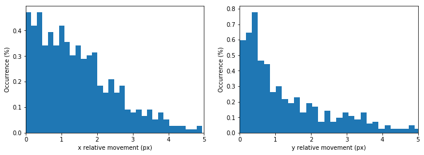

##### Evaluation of the model - 02[🡅](#iterations-index)

Lets look at the confusion matrix again:


The overall accuracy increased a lot from the *01-iteration*.

### Algorithm selection - 03[🡅](#iterations-index)
We now want to test different optimizers for the training. Up to now we used Adam with a learning rate of `lr = 0.001` and standard beta parameters (`beta_1=0.9, beta_2=0.999, epsilon=None, decay=0.0`). Before changing the optimizer we want to explore different values for the learning rate. We tested learning rates in the list `[0.01, 0.001, 0.0001, 0.00001]`. For each lr we initialize the model five times (changing the random seed) and we averaged the results. The accuracy and the loss function are plotted below:

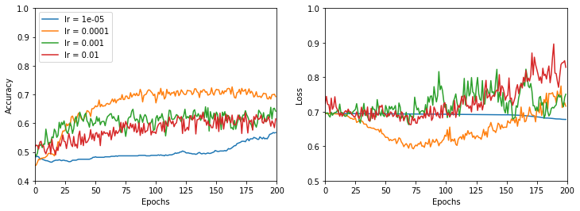

The smaller is the learning rate, the smoother is the evolution of the accuracy (and loss function). A learning rate of `0.0001` seems to be the best compromise between achieving good results and having a short training time.

##### Evaluation of the model - 03[🡅](#iterations-index)
To evaluate the model at this point, we used the best learning rate (`lr = 0.0001`) and we trained the network for 300 epochs instead of 200.

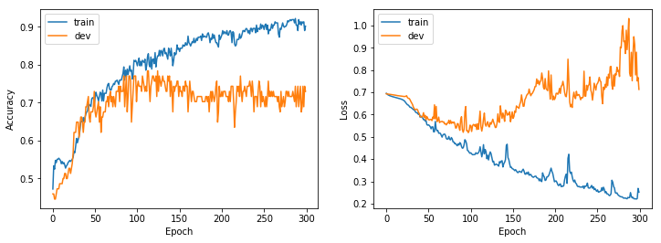

Here we can recognize the typical pattern of overfitting: the accuracy on the dev set increases until we hit 100 epochs, then it starts to decrease again. The same pattern, although reversed, appears in the loss function. With this model and dataset, we reached an accuracy of about 75%. To try to improve this result we can try different neural network models.

### Algorithm selection - 04[🡅](#iterations-index)
We now explore the performance differences for different batch sizes. We tested values in `[13, 32, 64]` and, for each value, we run the model 9 times using a cross-validation method. The result is showed in the figure below
:
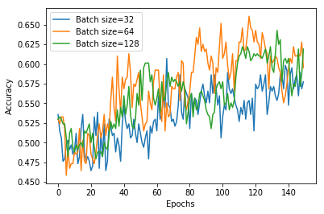

The differences are minimal. We chose a batch size of 32 since it gives better results faster. 

### Algorithm selection - 05[🡅](#iterations-index)
We now test a completely different strategy: using a support vector machine to classify our data. We used a bayesian optimization with cross-validation approach to find the optimal `gamma` and `C` parameters, but the best accuracy obtained is 62%, which is quite low if compared to the LSTM performance. We, therefore, go back to the recurrent NN strategy.


### LSTM size and learning rate with Bayesopt - 06[🡅](#iterations-index)
We use a Bayesian optimization approach to find the optimal number of neurons in the LSTM network and the optimal learning rate. We select the validation accuracy as the target variable to optimize. On the left, we see the performance estimation for a different number of LSTM neurons, on the x-axis, and for different learning rates, on the y-axis (obtained with a gaussian kernel). On the right panel, we plot the uncertainty of the gaussian model. Look at [this blog post](https://www.andreaamico.eu/machine_learning/2019/05/08/bayesian_opt.html) to have a short introduction on how to code Bayesian optimization. 

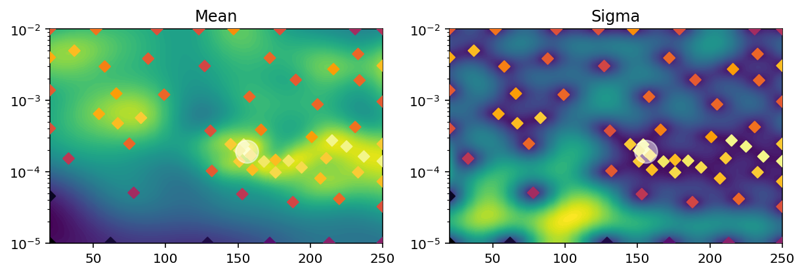

The optimal parameters seem to sit between 150 and 250 LSTM neurons, and a learning rate of about 1.5e-4.


### Introducing dropout - 07[🡅](#iterations-index)
We test if we can reduce the accuracy gap between training and validation by introducting dropout in the LSTM layer:
```python
LSTM(grid['LSTM_size'][1], input_shape=grid['input_shape'][1],
            kernel_initializer=glorot_uniform(seed=grid['seed_model'][1]),
            dropout=grid['dropout'][1])
```

We use a simple grid search to find the best dropout vs LSTM size. 


We do not detect significant improvements introduced by dropout. We confirm that an LSTM of at least 200 units to reach a validation accuracy higher than 70%. For the moment we will remove the dropout regularization from the model. 


### Checking training set size - 08[🡅](#iterations-index)
To check if the size of the training dataset is limiting the final accuracy we study the validation accuracy by artificially limiting the training set size.

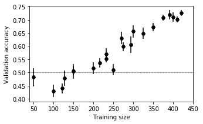

Up to 250 batches of training data the model are completely unusable: the efficiency is as good as a random guess. From 250 up to 430 the validation accuracy increases almost linearly and does not seem to saturate. This suggests that we are strongly limited by the size of our training dataset. acquiring more data seems to be a very promising path to improve our accuracy.

### New, bigger, dataset - 09[🡅](#iterations-index)
The previous section told us we need more training points. We constructed a new dataset obtained in a similar way but using a mouse instead of the touchpad. The movements are recorded while playing simple browser games like string.io. The new training size available is now of about 1800 different batches instead of 430. The result is terrible, the validation accuracy is incredibly small even with a git training set, never performing better than 0.6. Maybe the differences in the movements of the left and the right hands, using the mouse, are less sharp than the ones recorded using the touchpad. For the moment we will go back using the old touchpad dataset. 

### GRU instead of LSTM - 10[🡅](#iterations-index)
A popular variation to the LSTM network is the GRU network (Gated Recurrent Unit), which is generally faster to train. The first impression is very positive: the accuracy is good and looks much more stable. In addition to that, we also add the possibility to introduce a variable number of convolutional layers between the raw data and the GRU unit:

```python
from keras.models import Sequential
from keras.layers import Dense

from keras.layers.convolutional import Conv1D
from keras.layers.convolutional import MaxPooling1D
from keras.initializers import glorot_uniform


def create_model(grid):
    if grid['GPU'][1] == 1:
        from keras.layers import CuDNNGRU
        recurrent_unit = CuDNNGRU(grid['GRU_size'][1],
                   kernel_initializer=glorot_uniform(seed=grid['seed_model'][1]))
    else:
        from keras.layers import GRU
        recurrent_unit = GRU(grid['GRU_size'][1],
                   kernel_initializer=glorot_uniform(seed=grid['seed_model'][1]),
                   dropout=grid['dropout'][1])

    model = Sequential()
    for _ in range(grid['conv_layers'][1]):
        model.add(Conv1D(filters=32, kernel_size=3, padding='same', activation='relu'))
        model.add(MaxPooling1D(pool_size=2))
    model.add(recurrent_unit)
    model.add(Dense(1, activation='sigmoid', kernel_initializer=glorot_uniform(seed=grid['seed_model'][1])))
    return model
```


We start scanning the GRU size parameter, together with the number of convolutional layers:

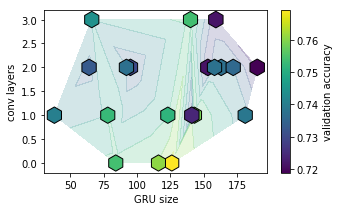

GRU unit size and the number of convolutional layers seem not to affect too much the overall validation accuracy, which is always found between 70 and 75%. To gain more insights on the effect of different network structure we plot the evolution of accuracy and validation accuracy during the training:

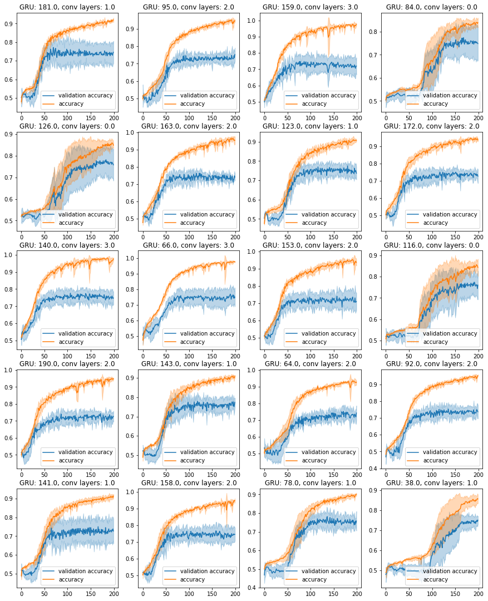

We can see how the training accuracy behaves much better than before, greatly exceeding the 90% limit set by the previous model. At the same time, we notice that the validation accuracy saturates around the epoch 100, at about 70-75%. This seems to be a clear indication of overfitting. Our idea is therefore to introduce some kind of regularization (e.g. dropout).

It is also interesting to isolate the effect of the presence of convolutional layers. In the following plot, we present the validation accuracy during the training for 0, 1, 2 and 3 convolutional layers between the input and the GRU unit.

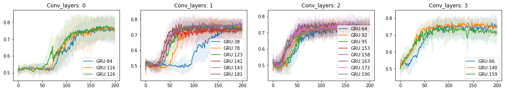

The presence of convolutional layers seems to increase the learning speed, moreover leads to cleaner results: the thickness of the shadow showing the variance of the signal decreases. For the future, we set the number of convolutional layers to be 3. 


### GRU and overfitting - 11[🡅](#iterations-index)
Now the training accuracy is great, but the validation accuracy does not increase more than 70-75%. After around 75 epochs of training, the validation accuracy stops to increase. This is a symptom of overfitting. To try to fix this we changed the GRU unit size (to reduce the complexity of the model) and introduce two dropout steps: recurrent dropout within the GRU layer, and classic dropout in between the convolutional layers. As we can see in the plot below none of these techniques worked out, but actually, reduce the performance of the model.

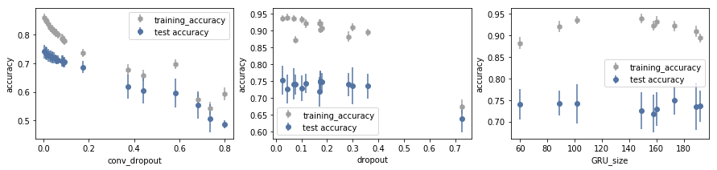


### GRU with mouse movement - 12[🡅](#iterations-index)

Since the bottleneck might still be the training size, we decide to try again our bigger dataset (the one obtained using mouse movements instead of touchpad ones)


