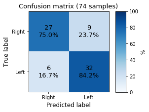

# DEEP MOUSE

In this project we follow the thought processes behind the development of a simple neural network. It is an A-to-Z description of a neural network construction, starting from the acquisition of the dataset up to the evaluation of the model, including errors and steps-back.

The goal of this toy algorithm is to identify if the laptop track-pad is used either with the right or the left hand just by looking at the position of the mouse cursor in time. The scheme of the development process can be sketched as follow:


It is an iterative process which periodically ends with the evaluation of the model using the **dev** (development) dataset. The iteration continues until the accuracy obtained on the dev set reaches our goal. Only at this point the model is tested on the **test** dataset.

## Iterations index
- [First model implementation](#identification-of-required-data---01)
- [Data pre-processing 02](#data-pre-processing---02)
- [Algorithm optimizer 03](#algorithm-selection---03)


### Identification of required data - 01[🡅](#iterations-index)
In order to train a model to recognize which hand is moving the mouse, we opted for a supervised learning approach and we therefore need labeled data to for the training. The structure of the dataset is a *.csv* file with two columns indicating the *x* and *y* absolute coordinate of the mouse cursor on the screen. The position is recorded every \~10ms. In order to create the training set, we recorded the mouse position for about 10 minutes, first by using the right hand (while reading a technical blog post), then doing the same task by using the left hand. The total amount of samples is 120k (60k right, 60k left).
The data are acquired using the win32gui library and stored in a *.txt* file via a python script:
```python
import win32gui, time
with open('./data/my_data.txt', 'a') as f:
    for _ in range(number_of_samples):
        x, y = win32gui.GetCursorPos()
        f.write('{},{}\n'.format(x, y))
        time.sleep(0.01)
```
Right hand data are saved on *./data/right.txt* file, left hand data on *./data/left.txt* file.
As shown in the plot below the real time delay between subsequent acquisitions is not completely constant, moreover spikes are present.


A possible improvement might be achieved by a pure c acquisition program, which includes a time delay check every loop. For the moment, since we do not know the impact of a more stable acquisition for the model accuracy, we postpone the problem for later iterations.

### Data pre-processing - 01[🡅](#iterations-index)
[Back to index](#iterations-index)
The full 20 minutes dataset is split in batches of 200 points each, corresponding to 2 seconds of mouse position acquisitions. Right and left hand data are merged together in a single dataset. For the moment we use raw data from the input device, being the absolute coordinate along the horizontal and vertical direction of the screen.

---------------
Loading the mouse data from the *.txt* file using **pandas**:
```python
import pandas as pandas
right = pd.read_csv("../data/right.txt", header=None).values.tolist()
left = pd.read_csv("../data/left.txt", header=None).values.tolist()
```
Splitting the data in 600 batches containing 200 data-points each:
```python
batch_size = 200
batch_right = [right[i:i + batch_size] for i in range(0, len(right), batch_size)]
batch_left = [left[i:i + batch_size] for i in range(0, len(left), batch_size)]
```
Merging left and right datasets and convert them into **numpy** arrays. Create the target array `y` using as convention *0* for batches corresponding tho right hand and *1* for left hand. The axis of the `X` array correspond to: (batch index, mouse position in time, mouse coordinate index).

```python
import numpy as np
X = np.array(batch_right + batch_left)
y = np.array([0]*len(batch_right) + [1]*len(batch_left))

print(f'X shape: {X.shape}\ny shape: {y.shape}')
```
```text
X shape: (600, 200, 2)
y shape: (600,)
```

For the moment the decision of creating batches of 200 data-points is arbitrary and we still do not know if we might need for longer batches in order to achieve a good accuracy. A batch of 200 points, using a 100Hz acquisition rate, means that we need 2 seconds of acquisition before the model can predict a result. In the plot below we show the data contained in a single data batch.


### Definition of the training set - 01[🡅](#iterations-index)
[Back to index](#iterations-index)
**Training**, **dev** and **test** sets are split in a 70%-15%-15% proportion. The training set is used for training the network, the dev set as a benchmark to optimize the ML algorithm and finally the test set to measure the accuracy of the model. It is important to keep dev and test set separated to avoid the over-fitting of the hyper-parameters of the model on the test set. 

------------
The splitting between train/dev/test is achieved using the **sklearn** library.
```python
from sklearn.model_selection import train_test_split

X_train, X_test, y_train, y_test = train_test_split(X, y, test_size=0.30, random_state=1)
X_dev, X_test, y_dev, y_test = train_test_split(X_est, y_est, test_size=0.5, random_state=1)
```

### Algorithm selection - 01[🡅](#iterations-index)
As a starting point algorithm we opted for a **RNN** (recurrent neural network). In particular, inspired from this [blog post](https://www.analyticsvidhya.com/blog/2019/01/introduction-time-series-classification/#), we used a **LSTM** (Long short-term memory) architecture.

-------------------
We implemented the neural network in **keras** using **TensorFlow backend**:
```python
import tensorflow as tf
from keras.models import Sequential
from keras.layers import Dense
from keras.layers import LSTM

model = Sequential()
model.add(LSTM(256, input_shape=(batch_size, 2)))
model.add(Dense(1, activation='sigmoid'))

model.summary()
```
```text
_________________________________________________________________
Layer (type)                 Output Shape              Param #   
=================================================================
lstm_1 (LSTM)                (None, 256)               265216    
_________________________________________________________________
dense_1 (Dense)              (None, 1)                 257       
=================================================================
Total params: 265,473
Trainable params: 265,473
Non-trainable params: 0
_________________________________________________________________
```

The training is performed using **stochastic gradient descent**, in particular using the **Adam** algorithm (short for Adaptive Moment Estimation). We used the *accuracy* metric and we trained the data for 200 epochs. We save the best model as *best_model.pkl*. It takes about 8 minutes to train the model using a regular laptop.
```python
from keras.optimizers import Adam
from keras.callbacks import ModelCheckpoint

adam = Adam(lr=0.001)
chk = ModelCheckpoint('best_model.pkl', monitor='acc', save_best_only=True, mode='max', verbose=0)
model.compile(loss='binary_crossentropy', optimizer=adam, metrics=['accuracy'])
history = model.fit(X_train, y_train, epochs=200, batch_size=64, callbacks=[chk], validation_data=(X_dev, y_dev))
```
The learning process during the gradient descent can be inspected by monitoring the accuracy of the model and the loss function, computed both on the training and the dev set.


The **accuracy** describes the ratio between the correct and the total guesses:
```text 
accuracy = number_of_correct_prediction / total_number_of_prediction_made
```
 The loss-function correspond to the **binary cross-entropy**, which is given by:
```text
loss = -(y log(p) + (1-y) log(1-p))
```
where `y` is the target correct binary label (0 for right hand, 1 for left hand) and `p` is the predicted probability for a given data batch to be a left hand batch. When the cross-entropy is *1* the model is useless and it is equivalent to a random guess. When it is *0* the model perfectly predict the target given a single data batch.

...TODO...

<!-- From the plot we can observe an accuracy increase both for the training set and the dev set, but the slope is very slow after about 75 epochs. The loss function decreases as well and it seems not to be saturated after 200 epochs of training. Maybe more training time might be beneficial. The best accuracy achieved on the dev set is of about 76\% which is a promising starting point. -->

### Evaluation of the model - 01[🡅](#iterations-index)
A simple validation of the model can be achieved using the **confusion matrix**, which reports the measure of the correct and non-correct labels computed by the model on the dev set.


The model produces very poor result but informations seems to be present in the data. We can also test the model live, loading it and using the script:
```python
from keras.models import load_model
import win32gui, time
model = load_model(f'../models/model_name.pkl')

def get_batch(batch_size=200):
    X_pred = np.ones([1, batch_size, 2])
    for index in range(batch_size):
        x, y = win32gui.GetCursorPos()
        X_pred[0,index,:] = np.array([x, y])
        time.sleep(0.01)
    return X_pred

time_in_sec = 30
left_guesses = 0
for index in range(1, max(2, int(time_in_sec/2))):
    X_pred = get_batch()
    pred = model.predict_classes(X_pred)[0][0]
    left_guesses += pred
    print(f'\rRun_{index}: Current prediction = {"Left " if pred else "Right"}   '+
        f'Left probability = {left_guesses/index * 100:.1f}%   '+
        f'Right probability = {(1 - left_guesses/index) * 100:.1f}%', end='')
 ```

### Data pre-processing - 02[🡅](#iterations-index)
An almost useful and safe pre-processing technique on data is their **normalization**. For the moment we used absolute screen coordinate but a very easy improvement is to normalize them by using the screen hight and width. An other option is to convert the absolute position of the mouse to the movement performed in 10ms. This might be useful because it simplifies the problem introducing a translational invariance along the coordinate, which looks to be a good symmetry to exploit. We start from this second option:
```python 
X_diff = X[:,:-1,:].copy()
X_diff[:,:,0] = np.diff(X[:,:,0])
X_diff[:,:,1] = np.diff(X[:,:,1])
```
At this point it is worthed to look at the relative movement amplitude distribution:


As we can see, the mouse cursor movement in 10ms ranges between 0 and 25 pixels. More importantly we notice that there is significant amount of data-point in which the cursor does not move at all. This is due to the fact that during the recording, while reading, the track-pad is untouched. Being this king of data completely irrelevant for the hand recognition problem it is worthed to filter them out in order to reduce the noise on the dataset:
```python
sigma_x = np.std(X_diff[:,:,0], axis=1)
sigma_y = np.std(X_diff[:,:,1], axis=1)

X_filt = X_diff[(sigma_x>0.1)*(sigma_y>0.1)]
```

Finally we normalize the dataset along the *x* and *y* direction dividing the dataset by the corresponding standard deviation. This correction is not dynamical but it is calculated statically only once. This is needed because the train/dev/test sets might have different variances, but the correction needs to be always the same:
```python
x_std = 3.398 # np.mean(np.std(X_filt[:,:,0], axis=1))
y_std = 2.926 # np.mean(np.std(X_filt[:,:,1], axis=1))

X_filt[:,:,0] = X_filt[:,:,0] / x_std
X_filt[:,:,1] = X_filt[:,:,1] / y_std
```
Here is how it looks the movement amplitude distribution after the cleaning and the normalization:


##### Evaluation of the model - 02[🡅](#iterations-index)

Lets look at the confusion matrix again:



The overall accuracy increased a lot from the *01-iteration*.

<!-- ### Algorithm selection - 03[🡅](#iterations-index)
We now want to test different optimizers for the training. Up to now we used Adam with a learning rate of `lr = 0.001` and standard beta parameters (`beta_1=0.9, beta_2=0.999, epsilon=None, decay=0.0`). Before changing the optimizer we want to explore different values for the learning rate. We tested learning rates in the list `[0.01, 0.001, 0.0001, 0.00001]`. For each lr we initialize the model three times (changing the random seed) and we averaged the results. The accuracy and the loss function are plotted below:


Solid lines refers to results obtained on the dev set while shaded areas refers to results obtained on the training set. The smaller is the learning rate, the smoother is the evolution of the accuracy (and loss function). A learning rate of `0.0001` seems to be the best compromise between achieving good results and having a short training time.

##### Evaluation of the model - 03[🡅](#iterations-index)
To evaluate the model at this point, we used the best learning rate (`lr = 0.001`), the best random seed and we trained the network for 300 epochs instead of 200. The confusion matrix of the dev set is the following:


The overall accuracy increased from the *02-iteration*, moreover, the right and left hand prediction success rate are now more balanced, which is a second clear improvement. -->